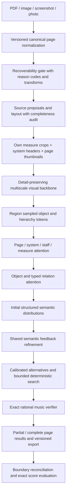

# Piano Vision V2 architecture RFC

Status: implementation decision recorded before major model edits, 2026-09-09.
Owner: Corranzo Piano Vision. Architecture contract: `piano-vision/2`.
This RFC is a decision and falsifiable engineering plan, not an accuracy claim.

## Accepted scope amendment: comprehensive notation fidelity

The user's second campaign requirement supersedes the original eleven-family
scope. The objective is high-fidelity MusicXML, including notes of ordinary,
grace, cue and other reduced sizes; nested tuplets; spans; expressive, textual,
piano and navigation markings. See `NOTATION_SUPPORT.md` for the required support
matrix and `notation-ontology.schema.json` for the versioned interchange contract.
Architecture support, actual supervision, adequate examples and export support
are four independent claims. More model parameters cannot replace missing labels.

Use a small set of extensible node categories: event, attribute, relation, span,
direction, context, structure and unknown. Each node has a namespaced type,
attributes, visual region references, endpoint references, confidence and audit
provenance. Preserve a lossless ordered MusicXML subtree for detailed notation
attributes; do not coerce free text to BPM, visual size to grace, or an unsupported
symbol into the nearest known class. A shared region-conditioned sequence decoder
is the extension point for structured attributes/text, rather than an independent
head per symbol. Its UTF-8 vocabulary is stable when new types are registered.
Schema/grammar validation happens before any generated tree becomes exportable.

Lossless interchange/roundtrip is distinct from visual recognition. Unknown visual
regions are retained with page/crop coordinates and review status in a sidecar and
MusicXML miscellaneous metadata; unresolved regions prohibit high-fidelity status.
Unknown-region *recall* still requires a detector/coverage audit and labels. Merely
having an UNKNOWN token is not a demonstrated unknown detector.

The verifier separates HARD invariants, SOFT priors and STYLE conventions. Hard
rules apply only when their prerequisites are known. Duration equality within
chords is not universal (MusicXML permits shorter additional chord tones); voice
gaps are not automatically invalid; free meter/cadenzas/pickups and hidden timing
must remain representable. Cross-staff voices are checked by logical identity,
not staff-local beat sums. Courtesy/editorial accidentals retain their appearance
independently of sounding alteration. No style heuristic deletes staccato from a
tied note. Reranking never destroys the original candidate and records alternatives,
probabilities, rule evidence, final choice and any unresolved review reasons.

The MusicXML reference explicitly separates grace, cue and regular note content,
and requires separate temporal modification and graphical tuplet spans for nested
tuplets. These are schema requirements, not inferences from symbol size.
[Note content](https://www.w3.org/2021/06/musicxml40/musicxml-reference/elements/note/),
[nested tuplets](https://www.w3.org/2021/06/musicxml40/musicxml-reference/elements/time-modification/),
[chord duration](https://www.w3.org/2021/06/musicxml40/musicxml-reference/elements/chord/).

## Goal and protected boundaries

Optimize complete written-score correctness on clean printed piano notation.
Preserve explicit abstention. Target a typical short score within 10 seconds on
consumer hardware; report first-page latency separately from total latency.
Do not optimize parameter count for its own sake. No full production training in
this campaign. Production archives, shards, canonical records, splits and the
completed V1 TINY run are immutable. Only train/validation content may be opened.
Test/future-test remain sealed. New adapters derive tensors without rewriting data.

## V1 evidence and failure mechanisms

1. `data.py:CanonicalImageResolver.resolve` pads crop bounds by 8% horizontally
   and 16% vertically, but `tensorize_scope` normalizes object coordinates against
   **unpadded** scope bounds. `model.py:MultiScaleObjectSampler` uses those values
   directly in grid sampling. This is a coordinate bug, not an abstract concern
   about context. Prior phase216 image-context approval did not test this mapping.
2. Neighbor objects are clipped to [0,1] in the current crop. They sample border
   ink instead of their own pixels. The sampler comment claiming zero evidence for
   out-of-scope objects contradicts the actual adapter.
3. `SCOPE_NUMBER` only parses `:semantic-mN`; repaired production IDs use
   `:pN-sN-xN`. Their order key is always 10**12; relation scope deltas become zero.
   Incidental input order can preserve sequence, but the temporal features cannot.
4. Source graph edges often use string primitive IDs. `_node_graph_features`
   requires integer endpoints and `tensorize_scope` performs integer lookup, so
   those edges do not contribute. The model already has attention (QKV graph
   blocks), but only a scalar untyped adjacency bias.
5. A 64-object cap and 256-pair cap silently remove predictions/supervision from
   dense measures and neighbor boundaries, then prevent completeness. Capacity
   limits must be observable and drive tiling/abstention, never conceal omissions.
6. Single-point image samples and pooled crop context cannot reliably expose
   distant key/clef changes, beam spans or dots outside the sampled point.
7. Key fifths and clef are independent note heads. Every scope head is instantiated
   but masked out in `_make_targets`. A learned temperature trained jointly with
   logits is not evidence of calibration. Auxiliary heads without labels do not
   represent learned capabilities.
8. Shared-head count does not represent multiple independently timed semantic
   roles at one physical head. One pitch/duration/lane tuple cannot encode that.
   V2 must declare unsupported role multiplicity until a role decoder is qualified.
9. V1 exactness metrics use label availability and confidence, require absent rare
   families, omit the verifier, and do not aggregate pages/scores. Zero complete
   output does not establish zero raw exact measures. Conversely, high head
   accuracy cannot establish score correctness or proposal recall.
10. V1 verifier sums chord members repeatedly, tests list order instead of timing,
    and permits missing meter/endpoints/fields through defaults in some cases.
    Its limited checks cannot certify a complete score.

The actual epoch-one validation file confirms 62.41% derived MIDI, 58.05% full
written pitch, 66.26% duration type at 28.05% coverage, 31.31% key fifths at 0.99%
coverage; all 63,086 scopes abstained. These are one-epoch TINY observations,
not a controlled V1/V2 accuracy comparison. Rest accuracy is also conditioned on
source proposals that already contain a notehead/rest kind feature.

## Alternatives considered

| Approach | Correctness opportunity | Efficiency | Risk / compatibility | Decision |
|---|---|---|---|---|
| Repair and scale V1 flat graph to 10–50M | Fix coordinates, more local capacity | Lowest implementation cost | Retains missing global context, independent semantics and proposal ceiling | Required baseline; insufficient destination |
| Full-page autoregressive image-to-MusicXML/score tokens | Can discover objects and infer layout jointly | Sequential decoding, long target sequences; accuracy/latency need direct measurement | Requires new sequence alignment, curriculum, tokenizer, export/error handling; weak transfer from current labels | Credible research comparator, not selected for this corpus campaign |
| Multi-scale CNN + explicit musical hierarchy + relation attention + shared refinement + deterministic decoder | High-resolution evidence, cross-measure context, auditable constraints and incremental pages | CNN features cacheable; bounded window attention; modular capacity | Moderate risk, reuses known semantic labels; source proposal recall remains a separate gate | Selected V2 |

Full-page convolution/autoregressive OMR is supported by the primary SMT paper,
not dismissed as impossible. Its different training representation makes it a
higher-risk choice here. [Ríos-Vila et al., revised 2025](https://arxiv.org/abs/2405.12105).
ConvNeXt demonstrates modern convolutional design remains competitive in general
vision; it does **not** establish superior OMR accuracy. We use its depthwise
large-kernel / channel-MLP pattern with a detail-preserving stem, subject to local
benchmarks. [Liu et al., 2022](https://arxiv.org/abs/2201.03545).
Temperature scaling must be fitted after training on a separate validation
partition. [Guo et al., 2017](https://proceedings.mlr.press/v70/guo17a.html).

## Selected data flow and module contracts

### Visual and layout inputs

No early stride-4 patchification. Preserve a stride-1 narrow detail feature map,
then progressively downsample at strides 2/4/8/16. Use region grids around object
bounds, not single center samples; keep stem/beam context in the enclosing view.
Each neighbor uses its **own** image view and transform. Letterbox isotropically;
persist source-to-view and inverse matrices including integer crop rounding.
Include full-page thumbnail context and high-resolution system-header crops so
inherited signatures have visible evidence even away from the first measure.
Do not pretend resizing a 1000px source page recovers missing detail.

Hierarchy tokens represent page, system, staff-in-system and measure. A separate
staff-in-measure context token permits mid-system signature changes. Parent edges
and relative geometry influence attention. IDs come from source layout only;
canonical target measure identity never enters model features. Unknown layout
must be flagged. Context targets are derived from KNOWN labels only; conflicting
values are masked with reasons, never majority-voted into truth.

### Relations, proposals and refinement

Score object pairs in both directions; do not assume x or array order resolves
ties/voices. Use explicit geometric pair features, source graph primitive
summaries with stable type vocabulary, hierarchy membership and predicted relation
messages. Semantic probabilities (not target labels) feed a shared refinement
block. Train initial and final outputs to avoid a useless first pass. Refinement
count is configured/versioned; ablate zero/one passes before selecting more.

Do not claim learned proposal discovery from a semantic classifier. Missing,
duplicate or ambiguous source objects bound attainable correctness. The contract
exposes proposal completeness and overflow. Spatial windows can carry cross-window
endpoints; unresolved endpoints prevent complete status. A future detector can
replace the proposal module without changing semantic tensors or evaluation.

Multi-role/shared heads require a physical-object → semantic-role interface.
Preserve multiplicity labels and refusal now; never emit one role as a complete
transcription when more than one is predicted/known to be required. Adding a role
decoder is an explicit readiness gate if production support requires these cases.

### Deterministic verifier and alternatives

Use exact `Fraction` time throughout decoding. Group chord members into one onset
interval per voice; do not add their durations. Check overlapping/discontinuous
voice intervals, positive durations, meter/capacity, explicitly scoped pickups and
irregular measures, chord pitch/attack relationships, tie pitch and endpoint timing,
tuplet duration arithmetic and declared group membership, staff/context identity,
accidental/key carry and continuation direction. Missing information is unknown,
not a successful check. Grace notes and intentional empty voices are explicit.

Bounded search scores neural alternatives by log probability, rejects contradictory
assignments and returns surviving alternatives plus repair provenance. If search
is truncated or multiple plausible solutions remain, abstain on affected measures.
Never silently change an accepted context, invent rests to fill measures, or use a
valid musical pattern as proof that the image was read correctly.

### Uncertainty and exact evaluation

Raw argmax accuracy and selective accuracy/coverage are separate. Post-training
temperature fitting and acceptance-risk selection use disjoint score-hashed slices
of validation, retaining selection/calibration provenance in the checkpoint.
Unknown head/family support cannot pass a complete gate. The default uncalibrated
artifact cannot mark anything complete. Choose risk thresholds with a one-sided
binomial upper bound; zero observed failures is not proof of zero true risk.

Exact measures/pages/scores require a complete expected-unit manifest, no omitted
objects/relations, complete truth for the evaluated domain and verified decoding.
Report raw exact, accepted exact, coverage, wrong-complete / all units, and
wrong-complete / accepted units, each with denominators. Missing pages/measures,
duplicate unit IDs and unresolved boundary ties must not disappear from counts.
Unknown truth is separately reported and cannot count as correct. No arbitrary
voice numbering penalty: canonicalize voice/chord identities by event membership.

### Input quality and streaming

PDF rasterization uses a page iterator. PNG/JPEG/screenshots/photos share grayscale
canonicalization with alpha compositing and EXIF orientation. Detect page corners;
apply a validated homography before quality gating. Estimate staff-line rotation,
expand the canvas to avoid rotation crop loss, and normalize lighting conservatively.
No binarization, staff erasure or sharpening that invents thin strokes by default.
Record transformations, raw/normalized dimensions, recoverability measurements and
machine-readable reasons. Angle alone is not a rejection reason.

Orientation 0/180 cannot be inferred from parallel staff lines alone: preserve
competing hypotheses for a semantic orientation scorer or request orientation
confirmation when ambiguous. Safe threshold defaults are engineering heuristics,
not calibrated readability probabilities. Glare/occlusion and cropped notation need
local staff coverage evidence; a global blur statistic is insufficient.

Per-page results stream with provisional boundary context and become final only
after reconciliation. Cache keys include pixel digest, preprocessing version,
backbone weights, precision and crop transform. Training recomputes features (no
stale detached caches). Deployment can batch independent pages; memory caps bound
parallelism. Core ML/INT8 are qualification targets, not assumed speedups.

### Versions, checkpoint migration and later adaptation

Separate versions for input contract, backbone, hierarchy, semantic vocabulary,
refinement, verifier and decoder. Strict resume requires exact architecture/config,
dataset lineage and optimizer/RNG state. Migration is a separate named operation:
copy only explicitly approved same-semantics keys with identical shapes/dtypes;
report every copied/skipped key. V1 encoder and new semantic representation are
not automatically compatible. Never slice or reshape tensors to fake a match.
Teacher distillation is optional on train-only images and only for supported heads;
one-epoch TINY is too weak to treat as ground truth.

Candidate checkpoints contain parent champion digest, supervised/replay manifest
digests, train/calibration/selection identities, schema versions and regression
reports. Personal upload pairs require alignment validation and semantic-source/
pixel deduplication before split assignment in a **new** adaptation dataset.
Promotion compares champion/candidate on the same frozen gates, refuses missing
metrics and per-family regressions, and records the decision without mutating the
champion. UI implementation is out of scope.

## Capacity and validation protocol

Implement sensible widths/depths near 10M, 25M and 50M; actual counts determine names
and tables. Benchmark synchronized MPS FP32 and FP16 and CPU FP32 separately. Report
raw tensor weight bytes for FP32/FP16/INT8, clearly distinguishing estimated INT8
storage from an actual quantized/converted artifact. Report training examples/sec,
inference median/p95, measured resident/allocator memory and measurement limitations.
Measure full loading/encoding latency separately from cached semantic inference.
Do not extrapolate single-measure timing into an alleged measured short score.

Tests: pixel/coordinate round trips and neighbor isolation; hierarchy influence;
input truth firewall; masked padding and empty graphs; directed relations;
refinement gradients; unsupported labels/overflow; verifier adversarial fixtures;
calibration partitions; complete-manifest aggregation; checkpoint mismatch and
partial migration; streaming ordering; quality normalization and unreadable input.
Run existing tests, then bounded real-train smoke/overfit and validation diagnostics.
Fewer-step overfitting establishes gradient/representation viability, not
generalization. Parameter/latency measurements alone cannot establish the quality
Pareto point: the final report must keep a serious-training readiness gate closed
if representative decoded exactness or required supervision remains unproven.
