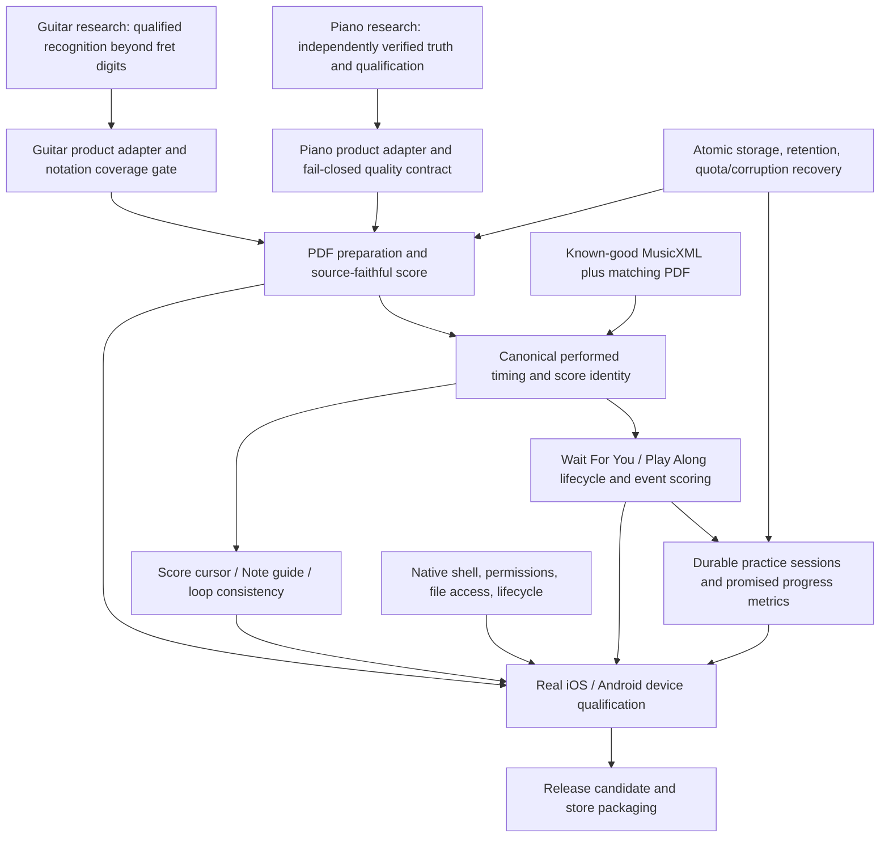

# Corranzo V1 product completeness audit

**Decision: NOT READY for App Store / Google Play release.** Approximately **60% complete (55–65% judgment range)** against the existing product promise, not a measured recognition-accuracy percentage or a forecast of remaining engineering time. The shell and score-reading experience are substantially built; practice correctness, durable recovery, recognition qualification, and native delivery still block release.

Audited 2026-10-07, America/New_York. Scope: A0–A19 of the requested product audit. No new instrument, social feature, gamification, Audio → Sheet Music, or Live Transcribe was added to V1.

## Baseline and evidence rules

- Worktree: `/Users/ryland/Documents/scoreflow-product-audit`.
- Branch: `codex/corranzo-product-completeness`.
- Product base: local `main`, **7348b699ac160a5d44f761a69c3aa7ff6488b72a**; this is also the supplied musician-UI integration commit. `git merge-base --is-ancestor 7348b699ac main` succeeded.
- After `git fetch origin --prune`, `origin/main` was **463a4285955dc02cd3931c8a3f0e9ce8da33175a**, older than local main. Neither research branch was used as the base, copied in, or modified.
- Read-only Guitar boundary inspection: `codex/guitar-vision` at **c1d8ff7ba0**. Its Python inference work is not proof of browser/product delivery. Piano research results were not promoted or re-certified by this audit.
- Resume verification (same session, 2026-10-07): Guitar tip had advanced to **939c0fe006** (`feat(guitar-vision): fret input-quality gate + V1 product integration prep`); `c1d8ff7ba0` is its ancestor. The tip commit touches only `docs/GUITAR_VISION_*` plus `tools/guitar-vision/python/` quality-gate code — no product `src/`/`worker/` changes, no merge into this baseline. A product-tree grep for `raw-ROI|guitar_vision|fretModel` callers returns nothing. The RESEARCH-BLOCKED Guitar conclusion is unchanged at the newer tip. Piano tip confirmed at **495002f647**; neither research branch was modified.
- Actual audit server: Vite rooted in this worktree, `127.0.0.1:5273`. An initial attempt encountered an occupied port 5199 belonging to another checkout. **All browser evidence from that initial attempt is excluded.** The two UI suites were rerun against 5273. An early contrast finding from the excluded run is not a finding on this baseline.
- **COMPLETE** means the specifically bounded capability in the row is implemented and validated. **PARTIAL** means useful implementation exists but required coverage or qualification remains. **BROKEN** means a reproduced behavior or explicit code path violates the intended contract. **MISSING** means no implementation was found. **RESEARCH-BLOCKED** means the promised recognition capability needs separately qualified science and its product integration.
- P0 = cannot release; P1 = must fix before public launch; P2 = desirable shortly after launch; POST-V1 = genuinely new scope. P0/P1 are both launch gates. A lack of native/hardware evidence is not called a reproduced hardware failure.

## A0 — Product map

| Area | Actual product / entry points | State and dependencies |
|---|---|---|
| Home / resume | `components/home/Home.jsx`: featured repertoire, current score, “Today’s practice”, continue unfinished import | Current score readiness/page; starter selection by instrument. No computed daily plan |
| Library | `components/LibraryPanel.jsx`, `features/library/practiceLibrary.js`: collection, filters/search, My Uploads | Built-in fixture manifest; **one saved score bundle per instrument**, not a general multi-score repository |
| Import | `components/library/ImportScoreView.jsx`, `MultiFileUpload.jsx`, `App.jsx` file handlers | PDF-first; optional MusicXML/MXL and MIDI companions; local file buffers, generation/cancellation guards |
| Practice | `components/practice/PracticeView.jsx`, `PracticeSessionContext.jsx`, `usePracticeSession.js` | Preview, Play Along, Wait For You; Score / Note guide; transport, hands, loops, marks, input devices |
| History | `components/profile/ProfileView.jsx`, `ManualPracticeLog.jsx` | Local manual journal plus separate automatic aggregates; not a unified event/session ledger |
| Settings | `components/shell/SettingsView.jsx`, `useWorkspacePreferences.js` | Instrument, surround, sidebar/workspace preferences; local browser storage |
| Routing | `App.jsx`, `features/navigation/appViewDebug.js`, `features/legal/legalRoutes.js` | Main views are React state; legal pages have pathname routing. Cloudflare provides SPA fallback |
| Score identity | `features/score/activeScore.js` | PDF content/meta identity, score ID, generation, owned XML/MIDI, OMR run. An adapter over legacy App fields, explicitly not yet a sole source of state |
| Score semantics | `features/musicxml/parseMusicXml.js`, `timeline.js`, `parseMeasureRepeats.js` | Notes/rests/parts/staves/voices, tempo and meter, written/performed time, repeats/endings, ties, expression, technical guitar positions |
| Playback | `useScorePlayback.js` → `ScorePlaybackEngine` → `scorePlaybackSchedule.js` | MusicXML/performed timeline required; optional MIDI mapped to score time; Tone/Web Audio and instrument sample voices |
| Page following | `useScoreFollow.js`, `cursorMotionTimeline.js`, note targets and source visual map | Audio clock plus PDF geometry, trusted anchors, OMR grid/source IDs, interpolation and disclosed approximate fallback |
| OMR | `PdfOmrPlaybackPanel.jsx` → `runPdfOmrClient.js` → browser worker → `runPdfOmrPipeline.js` | Local vector/raster heuristics; acceptance/quality gates; generated MusicXML and source visual map. No product Piano Vision HTTP service |
| Recovery | `useSessionPersistence.js`, `features/session/sessionPersistence.js` | LocalStorage metadata, IndexedDB blobs, restore timeouts/skip and instrument bundles. Seven-day expiry and non-atomic save boundary |
| Marks | `useAnnotationPersistence.js`, `utils/annotationStorage.js` | Synchronous completed-stroke save, fingerprint isolation, import/export, explicit save-error status |
| Inputs | `useWebMidiInput.js`, `useMicrophoneCapture.js`, `useWaitForYou{Midi,Mic}Input.js` | Web MIDI; raw microphone constraints, pitch/polyphony recognition, permission/device recovery; manual continue fallback |
| Cloud | `worker/index.js`, `wrangler.toml`, `platform/cloudflareSpaFallback.js` | Static asset delivery only; analytics script; local piano samples plus remote fallback; remote guitar samples. No account, cloud sync, or server OMR job queue in this product |
| Native | `package.json`, tracked-tree inspection | React/Vite web app and web manifest. No iOS project, Android project, Capacitor/native bridge, signing configuration, or store build pipeline |

### Dependency map



**Independent now:** timing/input correctness on known-good XML; storage; session ledger/metrics; UI/quality-message contract; native shell; accessibility; static release checks. **Research-dependent:** accuracy certification for piano PDF/scans and learned guitar extraction; integration of a qualified model/artifact. Visual rendering can be finished against correct XML before science is ready, but end-to-end PDF fidelity cannot be certified that way.

## A17 — V1 matrix

Evidence IDs refer to the runtime register below; source links/line anchors are in the code register. Detailed blocker acceptance criteria are in [V1_BLOCKERS.md](V1_BLOCKERS.md).

| ID | Capability | Classification | Priority | Evidence / remaining boundary |
|---|---|---|---|---|
| C01 | Musician shell, navigation, first-use flow, settings | COMPLETE | — | R1/R2; home/library/import/practice/history/settings, focus, responsive controls work |
| C02 | PDF selection, preparation stages, cancel/retry UI | COMPLETE | — | R1 real PDF preparation and cancel recovery; worker timeout/retry/cancel code. Recognition accuracy separately gated |
| C03 | MusicXML/MXL companion import | COMPLETE | — | `loadMusicXmlFile`, timing parser, full-suite coverage; XML invalid/no-note recovery in R1. PDF remains the visual source |
| C04 | MIDI companion parsing/mapping | PARTIAL | P1 | Performed mapping and mismatch warnings implemented; sustain supported from CC64. Full source-faithful expression/seek qualification still needed (B06) |
| C05 | Bad/unsupported/extra-file handling | COMPLETE | — | Limits, extension/MIME classification, corrupt XML/MIDI recovery, extra-file notices. Multiple PDFs deliberately use first |
| C06 | Score display, page/zoom/seek, focus | COMPLETE | — | R1/R2 real canvas, seek/bar change, mobile widths. Accuracy of arbitrary imported mapping is C07 |
| C07 | Arbitrary PDF measure/note/cursor alignment | PARTIAL | P1 | Shared timing plus geometry/source-map/interpolated fallbacks; matching PDF/XML and dense/unsupported sources need acceptance boundary (B06) |
| C08 | Markup and reload persistence | COMPLETE | — | R2 graphite stroke persists; synchronous saves and visible error state; corrupt storage/migration under C17 |
| C09 | Wait For You | PARTIAL | P1 | R3 single/repeated/chord/rest/tempo/seek/end works; restored-first-match defect R4 and mic/browser gap R6 (B04/B05) |
| C10 | Play Along correctness and attempt lifecycle | BROKEN | P1 | R3 MIDI accepts outside early window, pause clears outcomes, backward seek retains misses; no durable score-outcome history (B03) |
| C11 | Canonical timing architecture | PARTIAL | P1 | Canonical performed score exists; rendered/recognition clocks and loop ownership diverge (B06) |
| C12 | Visual Practice Mode / Note guide | PARTIAL | P1 | Actual staff/fixed playhead/chords/keyboard, both practice modes and source-aware rendering; feedback/lifecycle/source fidelity gates unresolved (B07) |
| C13 | Home / continue practicing | COMPLETE | — | R1 unfinished import routes honestly; prepared score resumes. “Today’s practice” is a heading, not a generated daily schedule |
| C14 | Session history / automatic tracking | BROKEN | P1 | R7 reload loses active elapsed time; manual/auto identities differ; R8 history totals cap at 20 (B08) |
| C15 | Comfortable tempo, clean runs, trouble spots | MISSING | P1 | No storage/computation/UI implementation found; current tempo/measures visited exist. These are requested existing V1 commitments, not proposed gamification (B09) |
| C16 | Manual session timer and journal happy path | COMPLETE | — | R2 timer → save with title/notes works; durability and retention failures are C14/C17 |
| C17 | Score/session durable storage and recovery | BROKEN | P0 | R7 quota save returns apparent success; expiry clears saved bundle; metadata/blobs saved separately (B01/B02) |
| C18 | Piano PDF/scanned recognition promise | RESEARCH-BLOCKED | P0 | Local heuristic OMR exists; no product Piano Vision service/model; independent verified science not delivered to this baseline (B10) |
| C19 | Guitar PDF/TAB recognition completeness | RESEARCH-BLOCKED | P0 | Current TAB rhythm approximate; raw-ROI learned branch not wired to product; notation/attachment/rhythm gaps remain after fret recognition (B11) |
| C20 | OMR quality/unsupported-notation contract | PARTIAL | P1 | Accept/warn/reject and diagnostics exist, but aggregate confidence is not notation-family completeness; unsupported semantics can be omitted (B12) |
| C21 | Sampled instrument playback core | COMPLETE | — | R3 actual browser reaches `sampled`; R9 trigger benchmark 14 fixtures, no missing/duplicate/stuck triggers; not a physical listening verdict |
| C22 | Playback device latency, pedal fidelity, long-run/lifecycle | PARTIAL | P1 | Source CC64, tempo/rate, pause/seek implementation; XML pedal absent; native/physical latency and 30-minute soak unverified (B05/B06/B13) |
| C23 | Local OMR job lifecycle | PARTIAL | P1 | Worker page timeout 120s, one retry, cancel, serialized preparation, partial-page warnings. Reload restarts, not resumable checkpoints; store durability B01/B02 |
| C24 | Static production delivery | COMPLETE | — | R10 HTTPS root/legal route work; deployed entry asset matches this build. Not an API health or model readiness check |
| C25 | Production reliability / offline operation | PARTIAL | P1 | No durable telemetry/release-health contract; guitar CDN dependency; no service worker/offline install contract; mobile no-network behavior unqualified (B13) |
| C26 | Native iOS / Android release artifacts | MISSING | P0 | No native projects/builds/permission declarations/store package pipeline (B14) |
| C27 | Responsive browser/touch layout | COMPLETE | — | R1 seven widths 390–1920 without horizontal overflow; real iOS/Android remains C28 |
| C28 | Native permissions, backgrounding, file picker, orientation/memory | PARTIAL | P1 | Web fallback/recovery code exists; no native target to validate; physical devices not tested (B15) |
| C29 | Shell/control accessibility | COMPLETE | — | R1 17 axe surfaces, keyboard/focus/drawer/reduced motion; R2 4 additional scans, no violations |
| C30 | Score/practice nonvisual and device accessibility | PARTIAL | P1 | Staff lane aria-hidden with textual target; actual screen-reader/touch-score workflow not tested (B16). Do not discard the validated shell work |
| C31 | Regression/tooling release confidence | PARTIAL | P2 | Build succeeds; seven known assertions fail; lint 256 findings. Real behavior defects have separate P0/P1 tickets; do not mask them with blanket test rewrites |

No auth/cloud-sync/API implementation is classified MISSING as a V1 feature: the current product explicitly stores scores/stats on the device. A future hosted research service will need its own production boundary before integration.

## A1 — Import and onboarding

The visible entry flow is **PDF-first**. A digital PDF or clear scan is intended; the import screen explicitly tells photo users to save/print as PDF. Direct JPG/PNG camera import is absent, but the baseline does not promise a native image picker. Do not invent one as a V1 blocker. Recognizing the intended photo-as-PDF input remains part of research/quality qualification.

`MultiFileUpload` has separate PDF and Advanced companion selection. MusicXML/XML/MXL are parsed, not rendered as standalone engraved sheet music. MuseScore files receive an export-to-PDF/XML explanation; MIDI is accompaniment, not the canonical score. There is no network score upload in this baseline: progress is local reading, page preprocessing/recognition, and playback preparation, not bytes sent to a server.

Hard file limits are PDF 80 MiB, MIDI 50 MiB, notation 30 MiB; soft warnings start at 25/15/10 MiB. The generated OMR result is separately limited to 6 MiB XML, 12,000 notes, 800 measures and 30 minutes. MXL decompression is not bounded by expanded-byte size in `loadMusicXmlFile`; the compressed-file limit and synchronous parsing timeout do not establish a mobile memory ceiling. This belongs to B13/B15.

R1 confirms first launch, keyboard tabs/search/empty states, actual PDF preparation, cancel → truthful “needs preparation”, retry/ready, mode choice, corrupt XML/MIDI blocked from bypassing readiness through Home/Library, and recovery to the saved PDF. Worker failure messages, retry, timeout and cancellation are implemented. Process interruption has no durable per-page job resume; re-enter Import and restart. The source survives only if its save succeeded.

Duplicate/extra selection is deterministic: first file of each kind wins and extras are announced. The active instrument has one saved upload slot. `ImportScoreView` explicitly warns that a new PDF replaces that instrument’s saved score; **a multi-score cloud library is not being added to this audit’s scope**. Content/owner/generation guards prevent stale companions attaching to a replacement PDF. Failure to persist that slot truthfully is still a P0.

## A2 / A5 — Score experience and canonical mapping

PDF.js renders the original score with page navigation, zoom, focus, annotations and page preloading/windowing. Score and Note guide are real alternatives. Page/bar seek, playback position changes, loop controls and markup reload were exercised; screenshot inspection confirmed legible staff/keyboard rendering on the test fixture. Phone overflow tests pass, while dense notation still needs zoom.

The architecture is better than independent audio and cursor approximations everywhere: `timeline.js` exposes performed notes/beats and time queries; `ScorePlaybackEngine`, WFY checkpoints and visual groups derive from that score. Content hashes/owner IDs prevent stale timing reuse; ties and repeated measures are represented. MIDI accompaniment uses performed-time mapping rather than replacing score time wholesale.

Remaining separations matter:

1. `activeScore.js` still mirrors legacy App state; owning IDs reduce risk but do not make the state transition atomic.
2. Audio/cursor/visual target can sample interpolated `getScoreTime()`. Input target/scoring uses React `practiceTime`; `useScorePlayback` explicitly throttles time display to a 100 ms interval with an animation-frame flush. Do not claim a constant 100 ms measured error: R3 saw approximately 19–27 ms differences in sampled snapshots.
3. `usePlayAlongLaneFeedback` has a -150/+280 ms helper window; the live MIDI hook bypasses that evaluator and accepts the currently selected checkpoint. R3 demonstrates the consequence, not just duplicate code.
4. `useLoopPlayback` reacts to React clock updates and seeks; loop cutoff is not owned by the audio scheduler, which queues up to 2.5 s ahead. Overshoot/glitches need measured loop-boundary qualification; this audit did not record physical output glitches.
5. PDF cursor positioning additionally depends on source visual anchors/measure grid, geometry calibration and interpolation. Approximate cursor/quick setup are disclosed. Correct XML does not prove the PDF pairing is correct.
6. `VisualPracticeView` builds semantic groups and rendering groups separately, then maps outcomes by onset/pitch with a 4 ms onset tolerance. Source-map provenance checking is useful; it is not universal proof of matching engraving.
7. Practice statistics count time/visited measures independently of accepted played events. They are not a canonical performance ledger.

## A3 — Wait For You

**PARTIAL, P1.** This is a functioning engine, not merely a button. R3 mounted the real `usePracticeSession` graph with real XML parsing, playback engine and a simulated Web MIDI device at the browser boundary. It tested C4, repeated C4, E4+G4, rest, then D4/E4/F4/G4 across a 60→120 BPM change. Wrong C#4 stayed at checkpoint 0; first C4 advanced to 1; held/no new note-on did not repeat; new C4 advanced to the chord; E4 alone stayed; G4 completed it and advanced over the rest to score time 4. Completion reached index 7; restart and seek to 4.5 s worked; audio stayed paused throughout WFY.

R4 instead initialized the hook with saved mode `wait-for-you` before asynchronous timing loaded. First correct C4 was counted in stats but left index/time at 0; a second attack advanced. With Preview initialized and WFY entered after loading, this did not occur. This is a reproducible lifecycle defect in the real hook graph; a full-app saved-session regression is needed to close B04. No claim that every WFY entry is broken.

Input matching has exact/octave/transposition settings, chord collection windows, wrong-note feedback, microphone attack latch and tied-sustain recognition. MIDI CC64 is tracked in the input activity model; WFY MIDI matching subscribes to note-on events, not a pedal correctness evaluator. R3 covers an unchanged held note by absence of another note-on; physical held-key/release/pedal behavior remains unverified.

The full suite passes recorded/synthetic pitch, chord, noise and re-attack gates. R6’s browser fake-microphone run granted access but did not advance on recorded C4 (including a padded recording); final status was “No input — check mic.” Quiet room did not advance. This does **not** prove a real-device detector defect or real-mic success: capture/calibration/harness behavior was not localized. Treat browser microphone end-to-end qualification as open, with actual devices required. Permission denial, device disconnect and audio interruption recovery code exists, but was not physically exercised.

Rests in note mode are skipped to the next attack; ties suppress re-attacks. This is coherent pitch-checkpoint behavior, not proof of duration/pedal grading. WFY completion is explicit; its completion callback labels completion as a loop even on a whole-piece pass, so “loops completed” is not necessarily clean loop practice. Saved loop bounds are passed to WFY even when the loop toggle is disabled (`loopRegion: loop.region`), unlike Play Along’s enabled-only group filter; B06 must resolve the intended disabled-loop semantics.

## A4 — Play Along

**BROKEN, P1.** Transport, score cursor, note targets, input listeners and feedback rendering exist. Source semantics come from the shared timing map. The acceptance/outcome lifecycle is not release-ready:

- R3 at score time ~0.563 s, with C4 targets at 0 and 1 s, sent C4. The first was already missed; the **1.0 s target became correct roughly 437 ms early**, outside `VISUAL_EARLY_INPUT_SECONDS = 0.15`.
- The live MIDI bridge reuses `useWaitForYouMidiInput`, which has no score-time-window argument. The bounded `evaluatePlayAlongNoteInput` path is not the MIDI callback actually wired in `usePracticeSession`.
- Pause makes `playAlongInputActive` false and resets outcomes; resume recreates groups. Completion also deactivates/clears the run rather than preserving a result.
- Backward seek while playing retained misses for the first two groups. Loop attempts reuse the same group IDs without a pass/attempt ID.
- Microphone V3 has early/on-time/late recognition decisions, but its target/time and MIDI grading are not the same contract. Chords have recognition code, not a complete cross-input timing acceptance proof.
- No Play Along hit/miss event stream is recorded by the current automatic stats tracker. WFY has explicit counters; Play Along callbacks only update visual outcomes.

Tempo, seek, pause/resume and loops operate as transport controls, but the correctness feedback and saved practice result do not survive those transitions coherently. A source-faithful timeline alone is insufficient to claim source-faithful practice scoring.

## A6 — Visual Practice Mode

**PARTIAL, P1; definitely implemented.** It ships under the musician-facing label **Note guide**, with a clear Score / Note guide toggle. `VisualPracticeView`, `StaffVisualLane` and `TabVisualLane` implement a horizontal staff/TAB surface, fixed follow bar, current/upcoming notes, stacked chords, piano keyboard or guitar fretboard, notation markings, rests and source provenance. WFY travel and Play Along audio-clock following exist. R1 opened it and passed axe; screenshot inspection of Menuet shows grand staff, fixed playhead and highlighted F keys. Runtime/visual unit tests pass.

It inherits B03–B06: unreliable outcomes across attempts, mismatched grading windows, restored-WFY transition, score/geometry coverage. It cannot be signed off for arbitrary research-generated scores merely because the polished fixture renders. Mobile dense scores, source-notation families, tempo/loop/repeat boundaries and correct/wrong feedback need one end-to-end acceptance suite. Keep the existing work; do not rewrite it as a new prototype.

## A7 — Practice/session experience

| Requested field | Actual computation / persistence | Verdict |
|---|---|---|
| Today’s Practice / continue | Current ready PDF or beginner featured piece; unfinished preparation goes to Import | Works; heading is not an adaptive plan |
| Automatic session timer | Accumulates while Practice view is open, including paused/idle time; UI explicitly calls it time with an open score | Real, but live segment lost on reload |
| Manual timer | Start/pause/resume/stop; user saves title/topic/type/notes | Works normally; no durable running draft and save failures ignored |
| Measures practiced | Set of measures visited, later added to aggregate; correctly labeled “Measures visited” | Navigation coverage, not evidence of correct playing |
| Current tempo | Live/effective tempo and last recorded tempo | Implemented |
| Comfortable tempo | No field, computation or progress UI found | MISSING, existing V1 commitment |
| Clean runs | No error-free attempt model | MISSING, existing V1 commitment |
| Trouble spots | No per-measure mistake/timing aggregation | MISSING, existing V1 commitment |
| Last played | Automatic session/end timestamp | Implemented, but can change from opening/leaving without playing |
| History | Manual journal entries; automatic aggregates are separate | Partial; no automatic per-run history or Play Along outcomes |
| Score-specific history | Auto piece ID from PDF metadata/fingerprint; manual piece ID from title slug | No reliable shared identity/join; same-title collisions possible |
| Retention | Manual recent sessions sliced to 20; headline totals recomputed from slice | R8 proves incorrect lifetime totals and loss of older entries |
| Restart/reload | Saved completed records reload; active auto segment/manual timer not durably checkpointed | Broken for promised recovery |

Do not label current visited-measure counters as performance accuracy. Do not add unrelated gamification. Implement only the requested tempo/clean-run/trouble-spot/session commitments on top of a real attempt ledger.

## A8 — Guitar product boundary

**RESEARCH-BLOCKED for PDF/TAB completeness; existing playback/practice UI is real.** Only Piano/Guitar are registered. Guitar currently has six-string standard tuning, notation/TAB/paired-layout detection, technical string/fret positions, derived fretboard positions when explicit positions are absent, chord-symbol/shape support, acoustic sampled voice, guitar-specific microphone matching, and the shared Score/Note guide/practice engine.

| Family | Product evidence / current limitation |
|---|---|
| Standard notation notes, rests, basic meter/key, chords/voices | Shared vector/raster pipeline and MusicXML parser; available, not universally accuracy-certified |
| TAB staff/fret/string | `detectTabNotation.js` extracts supported digits/geometry; unreadable TAB has explicit error. Learned raw-ROI fret model is absent from product |
| TAB-only rhythm | Explicit `tab-approximate-even`; notes evenly distributed/compressed to safe grid; warning says rhythm is approximate. High fret accuracy cannot fix this |
| Paired standard notation + TAB | `pairNotationTabEvents.js` and source-target geometry exist; timing/pitch pairing can warn on low confidence; ambiguous ownership remains qualification work |
| Chord symbols/diagrams | Chord-sheet parsing/shape targets exist; diagram/voicing/rhythm coverage must be verified per supported family, not inferred from frets |
| Ties/slurs/dots/tuplets/voices/beam durations | Detectors, parser and tests exist; independent extraction/attachment/rhythm validation still needed |
| Basic repeats/endings | Performed expansion implemented; uncertain repeats warn. D.C./D.S./Fine/Coda are explicitly unsupported/written order |
| Capo/tempo text | TAB text detector warns for capo, navigation and ritardando text; not complete transposition/tempo execution |
| Bend, slide, hammer-on/pull-off, vibrato | XML technique metadata/rendering exists for some; emitted technique metadata is not equivalent to expressive audio or grading support |
| Alternate tunings, harmonics, dead/ghost notes, palm mute, tapping, barre, advanced ornaments | No complete validated product ingestion→semantics→audio/practice/rejection contract found. Do not declare supported from the research taxonomy |

Read-only research boundary evidence: `codex/guitar-vision:tools/guitar-vision/python/guitar_vision/inference.py` provides a production-oriented **Python fret inference abstraction**, including the dedicated raw-ROI crop branch and one-page full-model constraint. Its commit title says production integration, but the official product `src`/`worker` has no corresponding caller/service. `notationFamilies.js` on that branch is an inventory, not completion evidence.

After fret-number recognition: locate/assign strings and notes; attach digits/markings to source events; derive duration/onset/voice/rests/ties/repeats; handle tuning/capo/transposition; qualify supported notation and explicitly reject unsupported sources; emit owned canonical score + source map; integrate deployment/timeouts/versioning if remote inference is chosen; then verify playback/cursor/WFY/Play Along. Do not merge the entire research branch: it contains unrelated divergence from the musician UI and Piano/shared OMR work.

## A9 — Piano product boundary

**RESEARCH-BLOCKED for the promised recognition quality.** This baseline does **not** contain a deployed learned Piano Vision pipeline. `runPdfOmrPipeline` drives local vector/raster extraction, score/rhythm reconstruction, MusicXML emission and source geometry. V3 confidence reasoning can fall back to legacy reasoning on error; independent/shadow work is not proof of replacing the production detector. Existing qualification documentation explicitly says the independent replacement gate was blocked; this audit does not treat those older experiments as the new verified dataset.

The product handles basic/grand staff, notes/rests/chords, accidentals/keys, duration/dot/beam inference, ties/slurs/articulation, tempo/dynamics and repeat-related symbols to varying degrees. Existing tests demonstrate cases, not complete notation-family coverage. Default tempo is 120 and is warned; default key/meter and recovery heuristics also exist. OMR recognition limits and aggregate quality gates reduce nonsense output, but do not establish correctness on dense multi-voice engraving or difficult scans/photos.

Direct photo import is absent; photo-as-PDF is explicitly invited. Clean/scanned PDF preparation is implemented with preprocessing. Image-quality, unsupported-notation and semantic-error coverage must be qualified against the separately verified Piano dataset before promoting a model. No research data/checkpoint/threshold was modified here.

## A10 — Playback/audio

The old “beep synth” diagnosis does not apply to the normal sampled path. Piano prefers bundled Salamander samples (`public/audio`, ~2 MiB total assets); CDN fallback and an explicit synth fallback remain. Guitar uses a remote acoustic sample set. R3 observed `instrumentStatus: sampled` in Chromium.

`ScorePlaybackEngine` uses 2.5 s lookahead, 200 ms scheduling ticks and 48-trigger yielding slices. It tracks score time from the audio clock, handles rate changes, pause, seek, stop and muted hands, and releases scheduled voices. Pure schedule tests cover repeats, ties, articulation and mapped MIDI. R9’s **Tone-double trigger benchmark** has 14 sampled fixtures, peak polyphony 18, no missing/duplicate/stuck triggers, no tie re-attacks and ordered dynamic levels. Its “clipping” metric is simulated; it is not an acoustic loudness/clipping measurement or a listening test.

MIDI CC64 sustain is applied before performed-time mapping. `parseMusicXml.js` does not parse pedal directions, so XML-only/OMR pedal fidelity is not complete. Live MIDI pedal is observed, not graded. Native Bluetooth/audio latency, hardware sound quality, interrupts/lock-screen behavior, physical polyphony and a full long-score soak were not measured. R3 tested a six-second score; R11 measures parse/lane performance, not long-running audio. This is why playback core can be COMPLETE while device/expression release qualification is PARTIAL.

## A11 — Storage/recovery

Session metadata version 1 lives in localStorage; blobs/source maps live in IndexedDB version 1 with fixed PDF/MIDI/XML and per-instrument keys. Completed strokes are saved synchronously and errors are visible. Practice/workspace preferences are separate localStorage records. Restore validates missing/stale companion metadata, handles timeouts/skip and discards late results.

Release defects:

- `loadSessionMeta` marks saves older than seven days expired; `useSessionPersistence.attemptRestore` **calls `clearSessionStorage()`**. R7 seeded an eight-day timestamp, reloaded, saw the expiry message and metadata became null. This is automatic destructive retention, even though a notice is shown afterward.
- `scheduleSave` writes metadata first, then blobs in multiple transactions. Blob failures are caught without a user-facing failed-save state; a crash can leave a new manifest with old/missing blobs. A failed metadata write returns silently. Library copy still says saved on this device.
- Manual/automatic stats writers ignore the boolean returned by `saveStats`; R7 returned one new manual entry while persisted storage still contained zero after injected quota failure.
- `loadStats`, settings and metadata loaders often return empty/default state on corrupt JSON. There is no quarantined recovery copy/migration path, only version checks/normalization.
- R7 kept the real score view open, reloaded before leaving, and found automatic accumulated seconds still zero. Automatic tracking flushes on effect cleanup/navigation, not a durable incremental checkpoint or page lifecycle commit.
- R8 confirms the 20-entry history/totals issue. Explicit bounded “recent list” is fine; silently truncating underlying history/lifetime totals is not.

No account/cloud sync exists or is promised by the current local-only UI. Adding one is not the required solution; durable local transactions, truthful save states and export/recovery are sufficient within V1 scope.

## A12 — Production/server reliability

The official product server is a **static Cloudflare asset/SPA worker**. There are no score-upload REST endpoints, authenticated accounts, hosted OMR jobs, API secrets, rate-limited inference, or server-side job persistence to certify. Do not create a fictitious backend blocker list. API auth/job lifecycle becomes a prerequisite only if a research runtime is actually introduced as a service.

R10: `https://corranzo.com/` and `/privacy` returned HTTPS 200 HTML and the same entry asset `/assets/index-CPxfiyxB.js` generated by this build. `/api/health` also returned the **identical SPA HTML**, not JSON health. All three response bodies had SHA256 `ea66941a59a7bee6935286cc918be303ddf808d78406a44ad0ed7ff286d0e0ae`. This supports static availability and a matching entry asset; it does not certify every deployed file or runtime service. The local Python certificate store failed verification, so successful read-only probes used curl with its normal certificate validation; TLS checks were not disabled.

Worker cache policy revalidates HTML and caches hashed assets immutably. Local OMR is cancellable and has page timeouts/retry; no reload-safe job checkpoints. No service worker/offline asset cache is present. Once loaded, local score processing has no server requirement, but cold/offline launch and remote guitar sample loading are separate risks. Analytics (`gtag`, public measurement ID) is not error observability or recognition monitoring. No embedded service credential was found in the inspected product deployment config; this was not a comprehensive secret scan of repository history.

## A13 — Mobile/store readiness

**Native artifacts MISSING (P0); responsive web PARTIAL as a store product.** Seven viewport widths passed in Chromium. Touch-target rules, file input, mic support detection, Safari audio unlock and visibility-resume helpers exist. Web MIDI limitations are surfaced. A manifest/favicon is not an iOS/Android application.

No Xcode/Gradle project, native permission descriptions/manifest, audio session/native lifecycle bridge, native file/camera integration, signing/package pipeline, device build or store package was found. This audit did not install a framework or perform submission. Existing web implementation should be wrapped/adapted after choosing the minimal native delivery path, with real iOS and Android tests for file selection, mic permission/denial/retry, rotation, lock/unlock, background/foreground, audio route interruptions, memory pressure, large scores and no network. Browser responsive screenshots do not answer those questions.

R11 on this Mac: 802-note/49-measure dense fixture parsed in ~61.0 ms; visual groups in ~6.49 ms; cached parse ~0.68 ms; displayed window 45 of 514 groups. Relative budgets pass. That is useful architecture evidence, not mobile memory/performance signoff. Very large PDF/MXL expansion and synchronous parsing still need constrained-device budgets.

Store/release work (package IDs, signing, binaries, permissions/privacy declarations, screenshots/listing, review preparation) is tracked separately from feature fixes in the execution plan. No claims of store-policy compliance are made from this source audit.

## A14 / A15 — Accessibility and error philosophy

Carry forward the musician UI: R1 passed **7 workflow checks, 17 axe scans, zero violations/page errors**, including skip link, route focus, keyboard tabs, dialogs, mobile navigation focus trap, reduced motion and seven widths. R2 passed **6 checks and 4 scans**, including real marks, loop setup, saved journal and Guitar UI. Score/Note guide presentation was visually inspected. The first non-audit-server run is excluded.

The notation lane is `aria-hidden` and has textual target/instruction UI; this avoids noisy SVG announcement but is not proof that all note/chord outcomes and transport actions are accessible to a real screen-reader musician. VoiceOver/TalkBack, touch assistive technology and dense-score workflows remain B16, not a reason to discard validated navigation.

Corranzo already exposes unreadable files, unsupported file types, uncertain rhythm, default tempo, low-confidence extraction, partial-page recovery, unreadable TAB, approximate TAB rhythm/cursor, and processing failure/retry. Good foundations exist. However, `assessOmrAcceptance` accepts aggregate structural diagnostics, not an exhaustive supported-notation contract. It cannot reject a semantic family that was never detected. XML technique flags can be preserved without corresponding performance semantics; XML pedal is omitted. Imported/reconstructed timing must not be labeled fully faithful when required notation was guessed or omitted. B10–B12 require calibrated rejection and explicit coverage, rather than lowering thresholds or merely relabeling everything “experimental.”

## A16 — Explicitly out of scope

POST-V1: Audio → Sheet Music; Live Transcribe; additional instruments beyond Piano/Guitar; new social/gamification functionality. Also not imposed by this audit: cloud accounts/sync, a multi-score repository beyond the disclosed single saved slot, native camera capture, or standalone XML engraving. None may substitute for completing the promised practice modes, Note guide, recovery, existing instrument recognition and session metrics.

## Runtime evidence register

| ID | Procedure actually run | Result and limits |
|---|---|---|
| R0 | Fresh `npm ci`; `npm run build`; `npm test`; `npm run test:scripts` | Build passed. 3273 passed / 7 failed / 7 skipped; 308 passing files / 7 failing / 1 skipped. Supplemental scripts passed. See verification below |
| R1 | `UI_REVIEW_ROOT="$PWD" UI_REVIEW_URL=http://127.0.0.1:5273/ node scripts/review-musician-workflows.mjs` | 7 checks, 17 axe scans, zero violations/page errors. Real PDF preparation, cancellation, corrupt companions, transport/modes, responsive/focus. Not input correctness by itself |
| R2 | Same env, `node scripts/review-musician-details.mjs` | 6 checks, 4 scans, zero violations. Mark survives reload; loop set; manual timer/save; surround; Guitar home |
| R3 | Temporary Chromium harness mounts **actual `usePracticeSession`** using `createMusicXmlSource`, fake Web MIDI API, real parser and Web Audio. Initial Preview, enter WFY after load; controlled two-bar score below | Wrong/repeat/chord/rest/tempo/seek/completion pass in WFY. Sampled playback confirmed. Play Along accepted ~437 ms early; pause erased outcomes; backward seek retained two misses. No page/console errors |
| R4 | Same hook harness, initial prefs `practiceMode: 'wait-for-you'`, timing loads asynchronously | Correct event counted but first advancement stayed at 0; next C4 advanced. Reproduced twice. Scope: hook restoration/initialization, not universal entry failure |
| R5 | Existing recorded/synthetic mic and polyphony tests in full suite | Relevant gates pass; includes 39 real-world WFY-gate tests. Deterministic recordings/signal tests are not physical mobile tests |
| R6 | Chromium fake capture with real-piano-c4, real-room-quiet, then C4 padded with 3 s silence; actual session mic path | Permission granted, C4 never advanced; no page errors, final C4 “No input — check mic”. Quiet room stayed. Unlocalized capture/calibration/harness gap; do not count as passed live microphone end-to-end |
| R7 | Isolated real app: open featured score, wait >3 s idle, reload; module call with injected `Storage.setItem` quota error; age metadata 8 days and reload | Active elapsed segment absent after reload; manual save returned 1 entry while persisted count remained 0; expiry message shown and metadata deleted |
| R8 | Actual `saveManualSession`/schema modules with in-memory Storage adapter; 21×60 s same piece | Headline 20 sessions / 1200 s, piece aggregate 21 / 1260 s. Confirms bounded-history totals inconsistency |
| R9 | `node scripts/piano-realism-benchmark.mjs`; inspected generated `audio-benchmark.json` | 14 sampled fixtures; zero missing/duplicate/stuck triggers, peak polyphony 18, dynamic ladder true. Tone double, not sound recording |
| R10 | Read-only curl GET `/`, `/privacy`, `/api/health` on corranzo.com with TLS verification | All 200 HTML; matching entry build asset. Health is SPA fallback, not a service check |
| R11 | `node scripts/heavy-score-performance-harness.mjs` | Relative/cache/window assertions pass; 802-note/49-measure dense parse ~61 ms; no physical-device or long audio soak |

### Reproducing the targeted runtime findings

The temporary harness created no application changes. Its core was a React component calling `usePracticeSession({musicXmlSource, hasPdf:true, instrumentId:'piano', initialPracticePrefs:{practiceMode:'preview', checkpointMode:'note'}, onRecordWfyEvent})`, exposing the returned object to the browser driver. Input was injected through `navigator.requestMIDIAccess` with one connected MIDI input and real `onmidimessage` events (`[0x90, pitch, 100]`, `performance.now()` timestamps), **not** by calling WFY's advance method.

Fixture: score-partwise XML, divisions 1, treble clef, 4/4; measure 1 tempo 60: C4 quarter, C4 quarter, E4+G4 quarter chord, quarter rest; measure 2 tempo 120: D4, E4, F4, G4 quarters. No OMR involved. Wait for timing map and playback load, set mode/input through returned session setters, then send the listed notes with 100+ ms between note-on events (E4→G4 within the 500 ms chord window). R4 changes only the initial mode to WFY. R3 Play Along waits for `playback.getScoreTime() > .55`, then sends C4; inspect `laneOutcomesByGroupId`. Pause then inspect; resume from zero without notes for ~2.3 s, seek to zero while playing, inspect again.

R7 quota injection is scoped to an isolated browser context: temporarily replace `Storage.prototype.setItem` with a function throwing `QuotaExceededError`, call `saveManualSession({pieceTitle:'Quota test', durationSeconds:60, instrumentId:'piano'})`, restore the function, compare returned and loaded `recentSessions.length`. No personal data or production writes were involved.

R8 reproduction (Node, repository root):

```js
const data = new Map()
globalThis.localStorage = {
  getItem: key => data.get(key) ?? null,
  setItem: (key, value) => data.set(key, value),
}
const { saveManualSession } = await import('./src/features/profile/manualPracticeLog.js')
let stats
for (let i = 0; i < 21; i++) {
  stats = saveManualSession({
    pieceTitle: 'Same piece', durationSeconds: 60,
    endedAt: Date.now() + i, instrumentId: 'piano',
  })
}
console.log(stats.totalSessions, stats.totalPracticeSeconds) // 20, 1200
console.log(Object.values(stats.pieces)[0].totalSessions) // 21
```

## Verification and audit limits

- Build: **PASS**, ~2.83 s; main bundle ~1,289.07 kB minified / 389.15 kB gzip; known >650 kB chunk warning. Output total ~17 MiB. This is not a reason by itself to call P0.
- Tests: **3273 passed, 7 failed, 7 skipped**, 88.28 s. Exact failures: `betaOnboarding`, `designPhaseA` contrast-token assertion, `ipadLayout`, `launchReadiness` Progress naming, `minimalAudioUi`, `mobileLayout`, `uxPolishSprint`. They match `docs/musician-ui/INTEGRATION.md`; source-text/design assertions require reconciliation, not an assumption that failing tests mean those entire features are broken. Actual current-worktree axe checks passed.
- Resume re-verification (same session): `npm run build` PASS in ~0.8 s, identical entry asset `/assets/index-CPxfiyxB.js`. `npm test` re-run: **3273 passed, 7 failed, 7 skipped** (316 files: 7 failed / 308 passed / 1 skipped) with the identical 7 failing files. No new regressions; the red branch state is unchanged and stays classified as P2 cleanup, not a product regression.
- Supplemental `test:scripts`: PASS, including alignment diagnostics/corpus.
- Lint excluding temporary audit harness: **256 findings (223 errors, 33 warnings)**. Command: `npm run lint -- --ignore-pattern 'tmp/v1-audit/**'`. These are pre-existing product/tooling findings, not introduced application edits. No blanket fixes performed.
- No subjective headphone listening, physical instrument, iOS/Android device, screen-reader, 30-minute playback soak, model accuracy re-training/re-certification, native build, deployment or store submission was performed.
- Browser scripts generate screenshots/reports in existing documentation/tmp locations. Those generated changes are excluded from this audit commit; the durable findings/reproduction details are in these three documents. Local raw evidence was preserved under `/tmp/corranzo-v1-audit-evidence` for this session, not assumed available to future clones.
- Only `docs/release/V1_COMPLETENESS.md`, `V1_BLOCKERS.md`, and `V1_EXECUTION_PLAN.md` are intentional committed changes. No product or research implementation changes.

## Code evidence register

Line numbers are anchored to the unchanged audited product commit. Runtime observations above are separate evidence, not inferred from these symbols.

| Source | Relevant contract |
|---|---|
| [src/features/score/activeScore.js:113](../../src/features/score/activeScore.js#L113) | Legacy state adapter, score ownership and replacement guards |
| [src/features/library/practiceLibrary.js:82](../../src/features/library/practiceLibrary.js#L82) | One saved instrument bundle and unconditional saved-description copy |
| [src/components/library/ImportScoreView.jsx:90](../../src/components/library/ImportScoreView.jsx#L90) | Disclosed single-score replacement scope |
| [src/components/library/ImportScoreView.jsx:93](../../src/components/library/ImportScoreView.jsx#L93) | Photo-as-PDF intended input |
| [src/components/MultiFileUpload.jsx:8](../../src/components/MultiFileUpload.jsx#L8) | PDF-first and advanced companion input |
| [src/features/import/classifyUploadFiles.js:93](../../src/features/import/classifyUploadFiles.js#L93) | Extra/unsupported file notices |
| [src/features/import/fileImportLimits.js:3](../../src/features/import/fileImportLimits.js#L3) | Hard/soft size limits |
| [src/features/musicxml/loadMusicXmlFile.js:52](../../src/features/musicxml/loadMusicXmlFile.js#L52) | ZIP loading without expanded-byte cap |
| [src/features/import/scorePreparationQueue.js:3](../../src/features/import/scorePreparationQueue.js#L3) | Serialized cancellation/replacement |
| [src/features/omr/runPdfOmrClient.js:13](../../src/features/omr/runPdfOmrClient.js#L13) | 120-second page timeout; retry/abort worker lifecycle |
| [src/features/omr/runPdfOmrPipeline.js:149](../../src/features/omr/runPdfOmrPipeline.js#L149) | Partial-page recovery defaults |
| [src/features/omr/runPdfOmrPipeline.js:960](../../src/features/omr/runPdfOmrPipeline.js#L960) | Confidence failure fallback |
| [src/features/omr/runPdfOmrPipeline.js:979](../../src/features/omr/runPdfOmrPipeline.js#L979) | Current production gate wiring |
| [src/features/omr/assessOmrAcceptance.js:88](../../src/features/omr/assessOmrAcceptance.js#L88) | Aggregate acceptance inputs, not family completeness |
| [src/features/omr/validateOmrGeneratedPlayback.js:4](../../src/features/omr/validateOmrGeneratedPlayback.js#L4) | Generated result resource limits |
| [src/features/omr/detectTabNotation.js:24](../../src/features/omr/detectTabNotation.js#L24) | Explicit approximate TAB timing |
| [src/features/omr/detectTabNotation.js:1098](../../src/features/omr/detectTabNotation.js#L1098) | Limited unsupported-notation warnings |
| [src/features/musicxml/parseMusicXml.js:518](../../src/features/musicxml/parseMusicXml.js#L518) | Explicit XML fret/string information |
| [src/features/musicxml/parseMeasureRepeats.js:418](../../src/features/musicxml/parseMeasureRepeats.js#L418) | Unsupported navigation falls back to written order |
| [src/features/musicxml/timeline.js:8](../../src/features/musicxml/timeline.js#L8) | Shared performed score facade |
| [src/features/playback/scorePlaybackSchedule.js:28](../../src/features/playback/scorePlaybackSchedule.js#L28) | Performed note scheduling |
| [src/features/playback/scorePlaybackSchedule.js:123](../../src/features/playback/scorePlaybackSchedule.js#L123) | MIDI CC64 sustain handling |
| [src/features/playback/scorePlaybackEngine.js:21](../../src/features/playback/scorePlaybackEngine.js#L21) | Lookahead/tick/scheduling slice constants |
| [src/features/playback/useScorePlayback.js:18](../../src/features/playback/useScorePlayback.js#L18) | Display clock throttling |
| [src/features/playback/pianoInstrument.js:29](../../src/features/playback/pianoInstrument.js#L29) | Bundled sampled piano; CDN fallback nearby |
| [src/features/playback/guitarInstrument.js:32](../../src/features/playback/guitarInstrument.js#L32) | Remote guitar sample dependency |
| [src/features/practice/usePracticeSession.js:220](../../src/features/practice/usePracticeSession.js#L220) | Saved position initialization |
| [src/features/practice/usePracticeSession.js:283](../../src/features/practice/usePracticeSession.js#L283) | WFY wiring including loop region regardless of enabled state |
| [src/features/practice/usePracticeSession.js:344](../../src/features/practice/usePracticeSession.js#L344) | Pause/completion disables feedback groups |
| [src/features/practice/usePracticeSession.js:510](../../src/features/practice/usePracticeSession.js#L510) | Live MIDI bypasses bounded play-along evaluator |
| [src/features/practice/usePlayAlongLaneFeedback.js:37](../../src/features/practice/usePlayAlongLaneFeedback.js#L37) | Inactive reset erases outcomes |
| [src/features/practice/playAlongLaneFeedback.js:72](../../src/features/practice/playAlongLaneFeedback.js#L72) | Bounded evaluator exists but is bypassed in live MIDI path |
| [src/features/practice/useWaitForYouMidiInput.js:58](../../src/features/practice/useWaitForYouMidiInput.js#L58) | Pitch/chord matching without score timing argument |
| [src/features/practice/useWaitForYou.js:116](../../src/features/practice/useWaitForYou.js#L116) | Consumed checkpoint and async advance lifecycle |
| [src/features/practice/useLoopPlayback.js:7](../../src/features/practice/useLoopPlayback.js#L7) | React-clock loop wrap |
| [src/components/practice/VisualPracticeView.jsx:65](../../src/components/practice/VisualPracticeView.jsx#L65) | Semantic-to-render outcome join |
| [src/components/practice/StaffVisualLane.jsx:185](../../src/components/practice/StaffVisualLane.jsx#L185) | Graphical staff hidden from assistive technology |
| [src/features/score-follow/useScoreFollow.js:135](../../src/features/score-follow/useScoreFollow.js#L135) | Score-follow authoritative clock plus geometry |
| [src/features/session/sessionPersistence.js:13](../../src/features/session/sessionPersistence.js#L13) | Seven-day expiry |
| [src/features/session/sessionPersistence.js:99](../../src/features/session/sessionPersistence.js#L99) | Separate per-file IndexedDB transactions |
| [src/hooks/useSessionPersistence.js:127](../../src/hooks/useSessionPersistence.js#L127) | Automatic destructive expiry path |
| [src/hooks/useSessionPersistence.js:289](../../src/hooks/useSessionPersistence.js#L289) | Metadata-first save; silent early return and subsequent swallowed blob errors |
| [src/features/profile/autoPracticeTracker.js:5](../../src/features/profile/autoPracticeTracker.js#L5) | Ephemeral automatic session |
| [src/features/profile/usePracticeStatsTracker.js:17](../../src/features/profile/usePracticeStatsTracker.js#L17) | Tick in memory; save on cleanup |
| [src/features/profile/manualPracticeLog.js:91](../../src/features/profile/manualPracticeLog.js#L91) | 20-entry truncation; ignored save result below |
| [src/features/profile/profileStatsSchema.js:107](../../src/features/profile/profileStatsSchema.js#L107) | Totals recomputed from retained recent sessions |
| [src/features/profile/profileStorage.js:29](../../src/features/profile/profileStorage.js#L29) | False returned on write failure |
| [src/hooks/useAnnotationPersistence.js:108](../../src/hooks/useAnnotationPersistence.js#L108) | Positive example: completed-stroke save result surfaced |
| [src/features/microphone-input/useMicrophoneCapture.js:34](../../src/features/microphone-input/useMicrophoneCapture.js#L34) | Device/context interruption handling |
| [src/features/audio/audioLifecycle.js:7](../../src/features/audio/audioLifecycle.js#L7) | Browser foreground resume, not native lifecycle proof |
| [src/context/PracticeSessionContext.jsx:91](../../src/context/PracticeSessionContext.jsx#L91) | Counts open score view, visited measure and tempo |
| [worker/index.js:4](../../worker/index.js#L4) | Static worker only |
| [wrangler.toml:3](../../wrangler.toml#L3) | Static asset deployment configuration |
| [src/platform/cloudflareSpaFallback.js:64](../../src/platform/cloudflareSpaFallback.js#L64) | HTML fallback and cache policy |
| [index.html:6](../../index.html#L6) | Analytics present |
