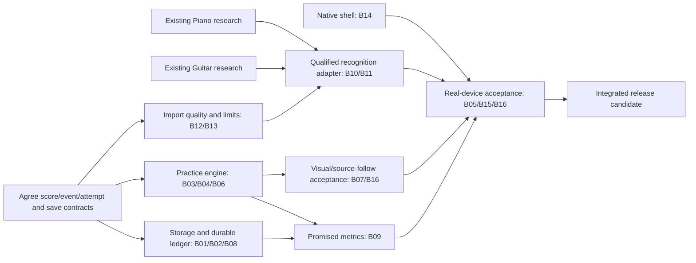

# Corranzo V1 dependency-aware execution plan

Audit base: **7348b699ac**, `codex/corranzo-product-completeness`, 2026-10-07. Companion records: [completeness](V1_COMPLETENESS.md), [blockers](V1_BLOCKERS.md). This is a plan, not implementation authorization for this audit. No new agents were launched; no features or research were changed.

## Shortest path

Keep the existing musician UI and shared performed timeline. Fix reliable practice on known-good XML, durable local state and native packaging while Piano/Guitar science continues independently. Then integrate qualified recognition behind a narrow contract, finish visual/session consumers, and run one integrated device release gate. Do not wait for OMR science to fix storage or practice behavior; do not ship a standalone model as if it were a finished instrument.

The graph indicates prerequisites, not an estimate of research duration. Science is an uncertain external critical path; no credible calendar completion date can be derived from this audit.

## Contracts to freeze before parallel file edits

Use a small shared document/fixture agreed by the implementation owners, not a wholesale rewrite:

1. **Score/time identity:** `scoreId`, source content hash, source event ID, performed occurrence, score time; an explicit source-confidence/unsupported-reason envelope. Repeats need occurrence identity, not just written measure number.
2. **Attempt/input event:** attempt/pass ID, authoritative score timestamp, input timestamp and latency metadata, expected/observed pitches, result, measure/tempo, mode, skip/manual-continue flags. Engine emits; storage consumes. This enables clean-run/trouble-spot metrics without duplicate grading.
3. **Persistence:** durable commit ID, pending/saved/failed state, recovery version. Only the committed bundle becomes restorable; display-list bounds never delete underlying history/lifetime totals.
4. **Recognition adapter:** versioned artifact/engine ID, supported-family coverage, rejection/uncertainty reasons, canonical score and source map. No implicit fallback to a confident “ready” result after model/service failure.

Integrator owns cross-cutting composition (`src/App.jsx`, `src/context/PracticeSessionContext.jsx`, shared fixture/types document, `package.json`, lockfile, Vite config). Owners propose small seam patches; the integrator applies them serially after their branches are reviewed. **No two concurrent agents edit these files.** Engine/storage owners can validate through isolated hook/adapter harnesses without changing production composition first.

## Parallel lanes and exclusive ownership

All new product worktrees start from the newest accepted official product baseline including this audit when available. None starts from Guitar or Piano research. Branch names below are recommendations, not branches created by the audit.

| Lane | Worktree / branch | Exclusive implementation files | Work / exit evidence |
|---|---|---|---|
| E — Practice engine | `scoreflow-practice-v1` / `codex/corranzo-practice-v1` | `src/features/practice/usePracticeSession.js`, `useWaitForYou*`, `waitForYou*`, `usePlayAlong*`, `playAlongLaneFeedback.js`, `usePracticeClock.js`, `practiceClock.js`, `useLoopPlayback.js`, `practiceLoopRegion.js`, `usePracticeLoop.js`; `features/playback/scorePlayback{Engine,Schedule}.js`, `useScorePlayback.js`; related input/musicxml timing modules and focused tests | B03/B04/B06; authoritative input clock/windows and attempt reset/preservation; restored first note; disabled loops; loop schedule/seek/pedal contract. Gate with injected MIDI and recorded mic before physical handoff |
| S — Durable storage/session | `scoreflow-recovery-v1` / `codex/corranzo-recovery-v1` | `src/features/session/*`, `src/hooks/useSessionPersistence.js`, `src/features/profile/*`, `src/context/ProfileStatsContext.jsx`, `components/profile/*`, `components/practice/PracticeStatsCard.jsx`; persistence/ledger tests | B01/B02/B08, then B09 once event contract is available. Atomic generations, no expiry destruction, truthful errors, corruption recovery, 21+ session totals, durable current segment, per-score ledger |
| N — Native/release | `scoreflow-native-v1` / `codex/corranzo-native-v1` | New `ios/`, `android/`, native configuration/build scripts; `src/features/platform/*`, `src/features/audio/audioLifecycle.js`, `src/platform/*`, `worker/index.js`, `wrangler.toml`, manifest, release/devices docs | B14; buildable platform shells, distribution/offline/version health; B15 physical file/mic/audio lifecycle. Dependency/package changes requested through integrator, not edited concurrently |
| Q — Import/quality boundary | `scoreflow-quality-v1` / `codex/corranzo-quality-v1` | `src/features/import/*`, `src/components/library/ImportScoreView.jsx`, `PdfOmrPlaybackPanel.jsx`, `src/components/MultiFileUpload.jsx`, quality UI banners; acceptance adapter/warnings tests. Shared acceptance-module changes reserved here until R starts | B12 plus B13 expanded import limits/recovery messages; refusal/unsupported-source contract, placeholders for research results. Do not change recognizer accuracy or research truth |
| V — Score/visual acceptance | `scoreflow-visual-v1` / `codex/corranzo-visual-v1` | `components/practice/VisualPracticeView.jsx`, `StaffVisualLane.jsx`, `TabVisualLane.jsx`, `features/practice/visual*`, `staffLaneLayout.js`, `tabLaneLayout.js`, `wfyVisualTravel.js`, `features/score-follow/*`, relevant score/visual CSS and tests | B07/B16; canonical event/occurrence joins, feedback/view-switch behavior, source layout qualification, accessible textual outcomes. Starts after E freezes required timing/checkpoint seams |
| R — Recognition product integration | `scoreflow-recognition-v1` / `codex/corranzo-recognition-v1` | New research-runtime adapter and deployment boundary, `features/omr/runPdfOmr{Client,Pipeline}.js`, worker/OMR boundary modules assigned explicitly after Q; no broad UI edits | B10/B11 product integration, artifact versioning, quality gate and end-to-end source fidelity. Starts only with a qualified candidate; server files/worker changes coordinated serially with N |
| P — Existing Piano research | Existing isolated Piano worktree | Its verified truth/dataset/training/qualification files only | Deliver verified held-out capability/reject report and versioned candidate. No app UX/timing changes |
| G — Existing Guitar research | Existing isolated Guitar worktree | Its datasets/training/inference/notation qualification files only | Deliver recognition/attachment/rhythm/family evidence and inference contract; fret metric alone does not close B11 |

`usePracticeSession`, `PracticeSessionContext`, imported-score state and shared OMR pipeline are high-conflict seams. In particular, **do not assign Visual and Engine agents to `usePracticeSession` simultaneously**, or Import and Storage agents to `App.jsx`. Piano and Guitar adapters should land sequentially through R if they touch the same pipeline. Existing Guitar research branch contains divergent product/shared research changes; cherry-pick reviewed boundary commits or use a versioned artifact, never an unreviewed whole-branch merge.

## Exact dispatch sequence with three implementation slots

Existing P/G research continues in its already isolated environment; do not spawn duplicate science agents. If those agents share the same execution capacity, schedule the new lanes within remaining slots instead of oversubscribing. The audit launches none of them.

### Wave 1 — Recommended next three agents

1. **Practice engine correctness (E).** Give it R3/R4 reproduction and B03/B04/B06. First result: a failing behavioral regression for early MIDI acceptance/pause/seek and restored WFY, then a focused fix using canonical time/attempt identity. Keep visual components and persistence untouched.
2. **Durable local recovery and session history (S).** Give it R7/R8 and B01/B02/B08. First result: atomic last-good score saves, no automatic expiry deletion, visible failed-save states, and preserved active/lifetime history. Define the event consumer now; implement B09 after E emits reliable events.
3. **Native delivery and device harness (N).** Give it B14/B15 and current local-only processing architecture. First result: minimal buildable iOS/Android shells and a repeatable permission/file/audio lifecycle smoke harness, plus explicit missing signing/account prerequisites. Do not submit stores or redesign screens.

These are independent highest-value tracks: practice quality and storage defects are actionable today; missing native artifacts cannot be solved by the OMR researchers.

### Wave 2 — Fill freed slots without overlapping files

- As E lands its timing/attempt contract, release E’s ownership for settled seams. Start V on score/visual consumers. S consumes the event schema for clean runs, comfortable tempo and trouble spots; it never reimplements pitch/timing grading.
- As N has both development shells and the device harness, it hands off remaining acceptance cases; start Q in that slot. N can return for device validation once integrated features exist. Q works on current quality/error contract and expanded-file resource limits without waiting for model readiness.
- Keep S in its slot until durable ledger/metrics are complete. If S finishes first, use its slot for Q sooner. This is a dependency-triggered queue, not a fixed wait for all three lanes.

### Wave 3 — Qualified research integration

- Start R only when P or G produces a qualification artifact. Q freezes the acceptance boundary first. Integrate one instrument at a time if the same pipeline files change.
- Use the now-fixed practice/visual/session system to evaluate the adapter end to end. Preserve the other instrument and musician UI with instrument-switch/source-replacement regression tests.
- If remote model inference is chosen, N/R define real endpoints/auth/limits/jobs/secrets/retries/observability before public enablement. The current static `/api/health` HTML response is not reusable proof of service health.
- If research remains blocked, keep the rest ready and report the exact unsupported boundary; do not silently remove an existing promised V1 feature or call a preview a completed release.

### Wave 4 — Integrated candidate, device gate, release handoff

Integrator combines reviewed commits on a dedicated product integration branch, preserving each lane’s regression evidence. Run one clean installation/build/test pass, critical behavior suites and native builds. N returns for physical acceptance with the integrated app; V verifies assistive technology; research owners sign the actual shipped artifact/version and supported-family envelope.

Release gate: all B01–B16 applicable P0/P1 closure criteria pass, no silent data loss, no unreliable transcription labeled confident, both stores have tested artifacts. Resolve meaningful test failures; quarantine stale source-text assertions only with a replacement behavior check and written reason. Native privacy/analytics/permissions/listing/signing/store submission are a separately authorized final release step, not done by this audit.

## Minimum integrated acceptance pack

| Pack | Concrete acceptance, beyond button presence |
|---|---|
| Import/quality | Valid PDF/XML/MXL; corrupt/empty/unsupported/oversized/decompression cases; duplicate/replace; cancel/retry; app killed mid-import; low-quality and unsupported notation rejected honestly; source retained |
| Identity/timing | Different same-name scores, instrument switches, stale jobs, source-map ownership, repeats/tempo/multi-voice/ties, cursor/highlight/audio on the same performed occurrence |
| WFY | Wrong/extra/repeated/chord/rest/tied-sustain; MIDI and real mic; first restored match; seek/restart/disabled loop/end; denial/unplug/retry |
| Play Along | Measured early/on-time/late windows; chord policy; fast notes; latency; pause preserves, seek/restart/loop creates intended attempt, completion saves; no stale prior-pass results |
| Visual | Staff/playhead/chords/keyboard/fretboard, Score toggle, both modes, source notation/provenance and mobile dense layout; textual accessible feedback |
| Durability/session | Failure at each save boundary; quota/corrupt/version/reload/crash/8-day return; active draft; 21+ history; title identity; comfort/clean/trouble metrics from actual events |
| Native/audio | Real iOS/Android file/mic flows, rotation/touch/AT, audio unlock/route/lock/interrupt/background/no network, 30-minute/large-score memory and playback soak |
| Production | Correct build/asset/version, static routing and useful health signals; model service operations only if introduced; no accidental secret/model/source-data exposure |

## What this audit changed

Only the three requested release documents. Diagnostic harnesses were temporary; generated QA files were removed from the commit. Existing application, Piano science and Guitar science remain unchanged. Audit artifacts are to be committed and pushed on `codex/corranzo-product-completeness`; **do not merge**.
