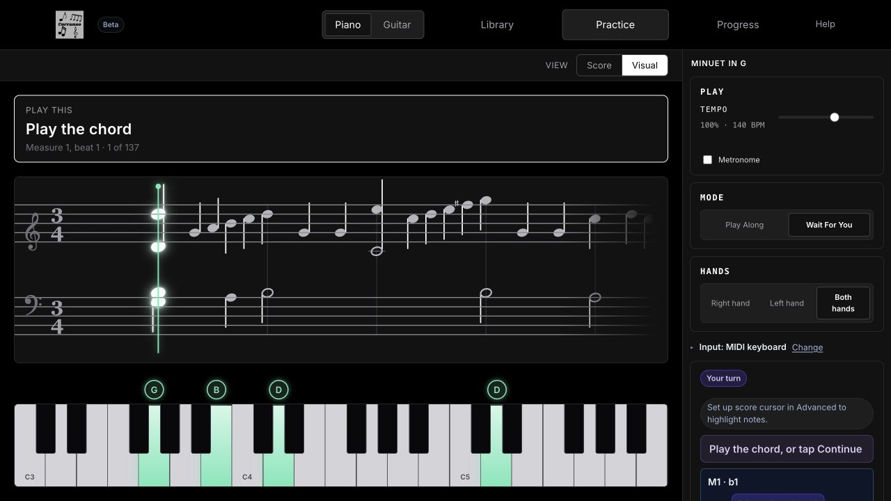
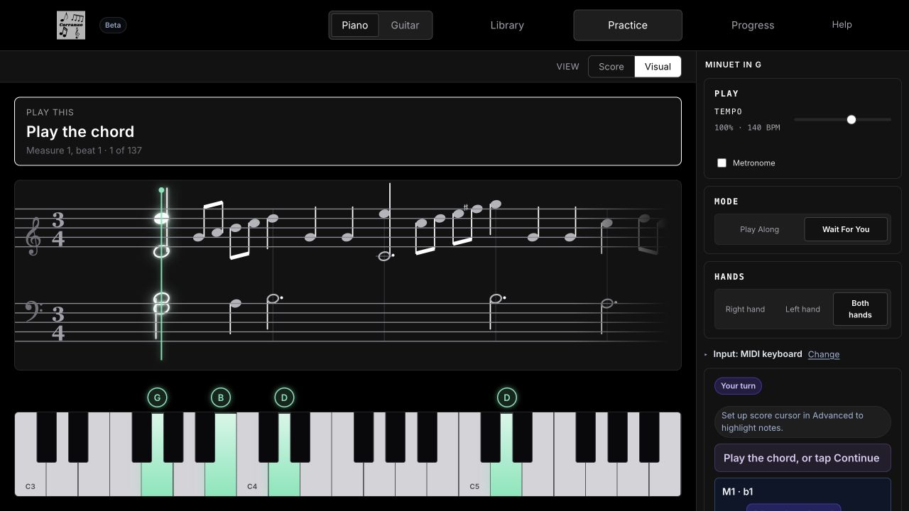

# OMR Notation Fidelity Sprint 2 — Focused Rhythm Slice

**Date:** 2026-07-26  
**Focused category:** written note values, dots, beams, and unsafe beam-like noise  
**Verdict:** the focused slice passes; the broader notation-fidelity sprint remains open.

## Frozen scope

No change was made to ActiveScore/source ownership, PDF cache lifecycle, piano
audio rendering, performed playback semantics, pitch improvements, Guitar,
repeats/tempo/dynamics, or the frozen semantic evaluator.

## Largest repeated root cause

Beam evidence was present on individual detected notes, but MusicXML emission
looked only at event-level evidence. When a beam was emitted, every chord tone
could receive it, every first note was a `begin`, and no `end` was generated.
Raster horizontal ink could therefore become beam tags on written quarter
notes. Independently, Visual Practice discarded written `type`, `dot`, and
`beam` metadata, so correct MusicXML still looked like a row of quarter notes.

This produced two repeated failure layers:

- **MusicXML emission:** real Evangelion eighth/sixteenth beam evidence vanished,
  while the articulation scan generated 99 unsafe beam tags on printed quarters.
- **Renderer / split semantics:** written eighth, quarter, half, whole, dotted,
  beamed, and flagged values did not have distinct visual forms even when
  playback timing and MusicXML type were correct.

## Small general fix shipped

1. Serialize beam evidence from the selected note/event only when the written
   type is beamable and an adjacent same-lane event supports a beam group.
2. Emit begin/continue/end and forward/backward-hook states per beam level.
   Do not broadcast one beam to every chord tone. Keep isolated or unsafe marks
   diagnostic-only.
3. Preserve `type`, `dot`, and `beam` metadata through the MusicXML parser into
   Visual Practice without changing duration or attack semantics.
4. Draw hollow/stemless heads, beams, isolated flags, and augmentation dots from
   that shared written metadata.
5. Correct MusicXML details found in the same trace: dotted rests now carry
   `<dot/>`, dotted fallback types are not double-undotted, and note children
   follow MusicXML order.

## Manual real-score validation set

`benchmarks/omr-notation-fidelity-validation/sprint2-cases.json` contains 42
manually verified cases. Every case records source/page/measure, expected
symbol, PDF crop, raw candidate, selected attachment, before/after MusicXML,
rendered result, playback result, and failure layer.

| Category | Cases | Correct before | Correct after |
| --- | ---: | ---: | ---: |
| Beams | 5 | 0 | 4 |
| Noise rejection | 5 | 0 | 5 |
| Note values | 9 | 0 | 8 |
| Dots | 8 | 0 | 8 |
| Rests | 4 | 0 | 0 |
| Accidentals / key signatures | 6 | 1 | 1 |
| Ties | 2 | 0 | 0 |
| Slurs | 1 | 0 | 0 |
| Articulations | 2 | 1 | 1 |
| **Total** | **42** | **2** | **27** |

The 25 newly correct cases are entirely within the prioritized rhythm/beam
slice. No result is claimed for the deliberately deferred categories.

### Failure-layer movement

| Layer | Before | After |
| --- | ---: | ---: |
| Symbol not detected | 7 | 7 |
| Wrong attachment | 2 | 1 |
| MusicXML emission | 6 | 0 |
| Renderer | 20 | 6 |
| Playback/notation split | 5 | 1 |
| Correct / none | 2 | 27 |

## Real-output evidence

### Evangelion

Page 1 measure 9 contains a detected beamed eighth→sixteenth endpoint.

- Before: 190 short written notes, zero `<beam>` elements.
- After: the verified pair emits primary `begin`/`end`; the sixteenth emits a
  secondary `backward hook`.
- MIDI, onset, duration, ties, staccato, accents, and total playback duration
  are exactly unchanged.
- The unresolved measure-14 beam group remains diagnostics-only because the
  detector supplied no reliable endpoint. No beam was invented.

### piano-articulation-scan

The PDF contains unbeamed quarters. Before, staff/tip-row ink produced 99 beam
tags: 19 `begin`, 80 `continue`, and no `end`. After, all 99 are rejected
because the written type is quarter. Note count, type, dots, ties,
articulations, attacks, and 32-second playback duration are unchanged.

### Minecraft and Gymnopédie

MusicXML note/type/dot counts and playback signatures are unchanged. Their half
and dotted values now render from written semantics instead of duration in
seconds. A Minecraft whole-note attachment error, Gymnopédie rests,
accidentals, ties, and curves remain open and were not hidden by this change.

### Clean engraved Minuet

The verified source has 207 notes, 85 eighths, 91 quarters, 30 halves, 17 dots,
and 42 primary beam groups. Visual Practice now renders 40 visible beam spans,
two isolated flags, 16 visible note dots (the seventeenth dot belongs to a
rest), and 29 hollow noteheads. The source MusicXML and playback events are
unchanged.

Before:



After:



Representative PDF crops are under `tmp/notation-fidelity-sprint-2/crops/`.
The full detector/event trace is
`tmp/notation-fidelity-sprint-2/raw-detection-trace.json`; aggregate counts and
playback comparisons are in `tmp/notation-fidelity-sprint-2/acceptance.json`.

## Articulation, curve, and accidental audit (unchanged)

The frozen Sprint 1 verified articulation set remains:

| Type | TP | FP | FN | TN |
| --- | ---: | ---: | ---: | ---: |
| Staccato | 3 | 0 | 3 | 2 |
| Accent | 0 | 0 | 6 | 0 |
| Tenuto | 0 | 0 | 0 | 0 |
| Marcato | 0 | 0 | 0 | 0 |
| Fermata | 0 | 0 | 0 | 0 |

The zero rows mean “not covered by verified positive cases,” not successful
recognition. Tie and slur verified positives also remain missing. Accidentals
remain 1/6 correct in the Sprint 2 case set. These categories were audited and
classified but not optimized in this focused change.

## Non-regression

- Four real-score before/after playback signatures compare equal for MIDI,
  onset, duration, tie flags, staccato, and accent.
- Total playback durations are unchanged:
  articulation 32 s; Minecraft 40 s; Evangelion 33.5839598997 s;
  Gymnopédie 83.3333333333 s.
- Frozen semantic corpus: all nine fixtures succeeded; Overall, Pitch, Rhythm,
  Sustain, Articulation, Measure Structure, and Interpretation deltas are
  exactly zero. The comparator reports no regression; its `ACCEPT: NO` is
  expected because that gate requires a semantic-score increase, while this
  renderer/emission fix intentionally leaves the frozen evaluator unchanged.
- 92 targeted OMR/renderer/playback/audio tests pass.
- Production build succeeds.
- Full repository run: 2,595 pass, 5 skip, 9 fail across six unrelated
  existing-worktree areas (`productFixes`, detached-buffer demo OMR,
  `omrTieRecall`, piano guidance wording, score-source gate shape, and
  decorative negative-page fixtures). None touches the focused files or fails
  the 92-test notation/playback/audio gate.

## Remaining work and sprint boundary

This does **not** claim completion of all notation fidelity. The next focused
root cause should be rest rendering/detection or visible accidentals whose MIDI
is already correct. Ties/slurs and raster articulation recall remain open.

The focused Sprint 2 rhythm slice passes because generated notation visibly
matches real notation better, unsafe beam false positives fall sharply, and
performed events remain unchanged. The overall five-category notation-fidelity
program does not pass yet.

## Re-run

```bash
node scripts/notation-fidelity-sprint2-probe.mjs
npx vitest run tests/notationFidelitySprint2.test.js tests/staffLaneLayout.test.js \
  tests/visualNotationMarkings.test.js tests/notationFidelitySprint1.test.js \
  tests/pdfOmr.test.js tests/playbackSchedule.test.js \
  tests/playbackSemanticsSprint1.test.js tests/pianoRealismSprint1.test.js
npm run omr:semantic-corpus -- --label notation-fidelity-sprint-2 --mode written \
  --json tmp/notation-fidelity-sprint-2/semantic-after.json \
  --text tmp/notation-fidelity-sprint-2/semantic-after.txt
node scripts/omr-semantic-corpus-eval.mjs \
  --compare tmp/notation-fidelity-sprint-1/semantic-after.json \
  tmp/notation-fidelity-sprint-2/semantic-after.json \
  --json tmp/notation-fidelity-sprint-2/semantic-delta.json \
  --text tmp/notation-fidelity-sprint-2/semantic-delta.txt
npm run build
```
